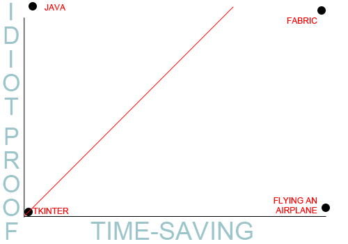

public: yes
tags: [python, flask]
summary: Be lazy.

==================================
Python code deployment with Fabric
==================================

So last night at the `IndyPy <http://www.meetup.com/python-182/>`_ meetup I gave a very impromptu talk on `Fabric <http://www.meetup.com/python-182/>`_. It lasted maybe five minutes and afterward I really felt like I just did not do this great tool justice. In order to make up for that, I thought I'd dive in a little deeper to Fabric.

-----------------
Why I am an idiot
-----------------

First and foremost, I love Fabric because **it lets me be lazy**. For far too long while I was developing `Yukmarks <http://yukmarks.com>`_, I was manually typing things like:

.. code-block:: bash

 local$ ssh my-ip-address.com
 remote$ git pull && sudo /etc/init.d/apache2 restart && ./manage.py dump_data && pg_dump >> foo.txt

That's right:

 1. ssh to my "production" server
 2. pull the latest revisions
 3. use django's built-in data dump to back up my database
 4. *also* use the postgres dump
 5. not pictured: updating the `Haystack <http://haystacksearch.org/>`_ search index for `Whoosh <https://bitbucket.org/mchaput/whoosh/wiki/Home>`_

You get the picture. It was ugly, and stupid, and time consuming, and I literally cannot believe that I spent all those calories typing those commands in over... and over... and over again. 

-----------------
Why I love Fabric
-----------------

So then `someone <http://bretthoerner.com>`_ introduced me to Fabric. I now use Fabric to automate code deployment. (See my full fabfile `here <https://github.com/mattdeboard/Yuk/blob/master/fabfile.py>`_.)

(In no way do I claim to use Fabric to its full potential, nor do I claim to be an expert, nor do I claim that my fabfile is *fabulous*. If you've got tips or corrections, please leave them in the comments.)

To make Fabric work, you just import the API and you're off:

.. sourcecode:: python

 from fabric.api import *
 from hosts import hosts, secret

 # I keep my hosts and auth data in a local file called hosts.py
 env.password = secret
 env.hosts = hosts

 def git_pull():
    run("cd %s; . bin/activate; cd %s; git pull; ./manage.py schemamigration"
        " --auto yuk; ./manage.py migrate yuk;cp %s* %s;sudo /etc/init.d/apache2"
        " force-reload" % (domain_dir, appdir, css_dir, static_file_dir))

The above code is exactly what it looks like: a number of semicolon-separated shell commands. It's probably the most idiot-proof, time-saving thing I've ever used. Please see the below:

Stop typing so much. Fabric makes things ridiculously easy.

**p.s.** In addition to Fabric, you'll definitely want to incorporate cron & creative use of your Makefile to make your life easier. Consult `the github repo <https://github.com/mattdeboard/Yuk.git>`_ for Yukmarks.

